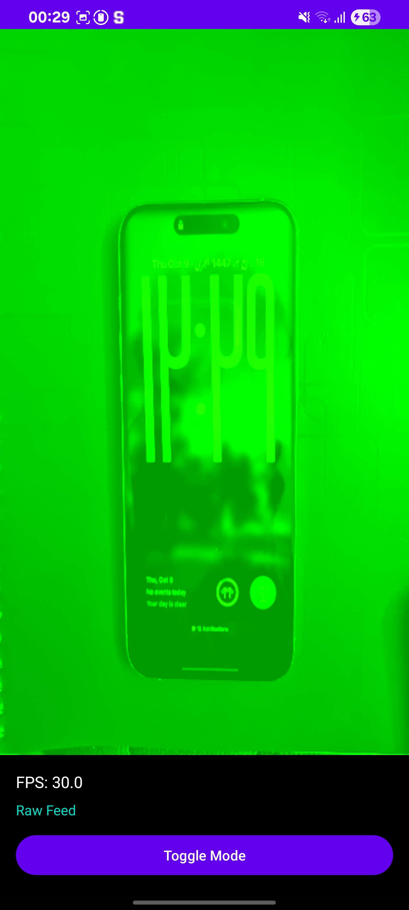
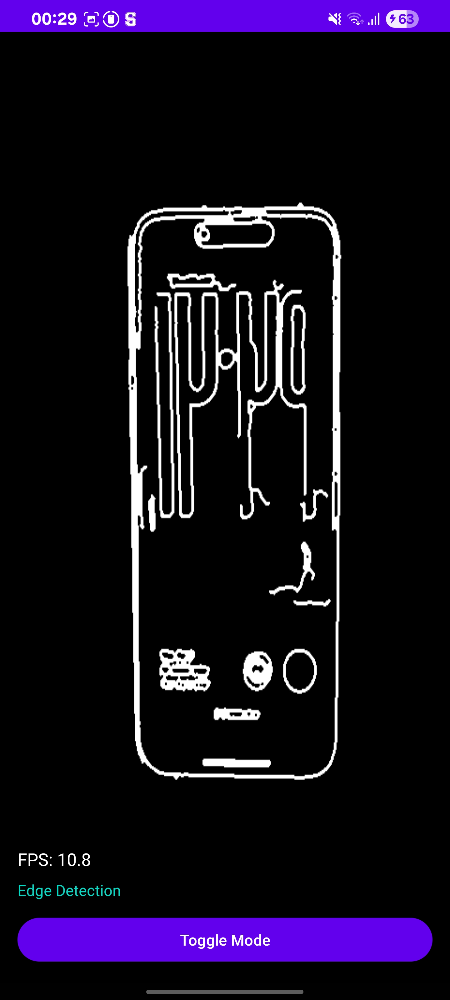

# 🎨 Edge Detection - Android + OpenCV + OpenGL ES + TypeScript

A real-time edge detection viewer Android application that captures camera frames, processes them using OpenCV in C++ via JNI, and displays the processed output using OpenGL ES 2.0. Includes a TypeScript-based web viewer for displaying processed frames.

## 📱 Demo


*Real-time edge detection using Canny algorithm*

## ✅ Features Implemented

### Android Application
- ✅ **Camera Integration**: Real-time camera feed using CameraX API
- ✅ **Native Processing**: OpenCV C++ image processing via JNI
- ✅ **Canny Edge Detection**: High-performance edge detection algorithm
- ✅ **OpenGL ES Rendering**: Hardware-accelerated texture rendering
- ✅ **FPS Counter**: Real-time performance monitoring
- ✅ **Mode Toggle**: Switch between raw feed and edge-detected output
- ✅ **Modular Architecture**: Clean separation of concerns

### Web Viewer (TypeScript)
- ✅ **Frame Display**: Canvas-based image rendering
- ✅ **Client-Side Edge Detection**: Real-time Sobel operator processing
- ✅ **Statistics Overlay**: FPS, resolution, processing time
- ✅ **File Upload**: Load and automatically process custom images
- ✅ **Sample Generator**: Built-in test frame generator
- ✅ **Responsive Design**: Mobile-friendly UI

## 🏗️ Project Structure

```
edge-detection/
├── app/                                    # Android application
│   ├── src/
│   │   └── main/
│   │       ├── java/com/flam/edgedetection/
│   │       │   ├── MainActivity.kt         # Main activity with camera setup
│   │       │   ├── NativeLib.kt           # JNI interface
│   │       │   └── gl/
│   │       │       └── GLRenderer.kt      # OpenGL ES renderer
│   │       ├── cpp/                       # Native C++ code
│   │       │   ├── CMakeLists.txt         # CMake build configuration
│   │       │   ├── native-lib.cpp         # JNI implementation
│   │       │   ├── edge_processor.h       # Edge processor header
│   │       │   └── edge_processor.cpp     # OpenCV processing logic
│   │       ├── res/                       # Android resources
│   │       └── AndroidManifest.xml
│   └── build.gradle
├── web/                                   # TypeScript web viewer
│   ├── src/
│   │   └── index.ts                       # Main viewer logic
│   ├── index.html                         # Web page
│   ├── styles.css                         # Styling
│   ├── package.json
│   └── tsconfig.json
├── settings.gradle
├── build.gradle
└── README.md
```

## 🧠 Architecture Overview

### Data Flow

```
Camera Feed → YUV420 Image
    ↓
YUV to RGB Conversion (JNI)
    ↓
Native C++ Processing (OpenCV)
    ↓
Canny Edge Detection
    ↓
RGB Output → OpenGL Texture
    ↓
Hardware Rendering (OpenGL ES 2.0)
```

### Components

1. **MainActivity (Kotlin)**
   - Manages camera lifecycle
   - Handles permissions
   - Orchestrates frame flow
   - Updates UI (FPS, mode)

2. **Native Layer (C++)**
   - `edge_processor.cpp`: Core OpenCV operations
   - `native-lib.cpp`: JNI bridge between Java and C++
   - Gaussian blur → Canny edge detection → RGB conversion

3. **OpenGL Renderer (Kotlin)**
   - Creates OpenGL ES 2.0 context
   - Manages textures and shaders
   - Renders frames at 60 FPS

4. **Web Viewer (TypeScript)**
   - Displays exported frames
   - Shows performance statistics
   - Modular, type-safe code

## 🚀 Quick Start Guide

### Running the Web Viewer (Easiest Way to Test!)

1. **Navigate to web directory:**
```bash
cd web
```

2. **Install dependencies:**
```bash
npm install
```

3. **Build TypeScript:**
```bash
npm run build
```

4. **Start the server:**
```bash
npm run serve
```

5. **Open in browser:**
```
http://localhost:8000
```

6. **Test edge detection:**
   - Click "📁 Upload Image" and select any photo
   - Watch it automatically process with Sobel edge detection!
   - Check the stats panel for processing time

### Running the Android App

#### Prerequisites

- Android Studio Hedgehog (2023.1.1) or later
- Android SDK 24+ (Android 7.0+)
- NDK (23.1.7779620 or later)
- CMake (3.22.1+)
- OpenCV Android SDK 4.8.0+
- Physical Android device or emulator with camera

### OpenCV Setup

1. Download OpenCV Android SDK from [OpenCV Releases](https://opencv.org/releases/)
2. Extract the SDK
3. Create `opencv` module in your project:
   - Copy `sdk/native` folder to `app/src/main/cpp/opencv/sdk/native/`
   - Or create a separate OpenCV module and import it

**Alternative**: Add OpenCV as a Gradle dependency:
```gradle
dependencies {
    implementation 'org.opencv:opencv:4.8.0'
}
```

#### Steps to Build and Run

1. **Clone the repository:**
```bash
git clone <repository-url>
cd edge-detection
```

2. **Open project in Android Studio:**
   - File → Open → Select the `edge-detection` directory

3. **Sync Gradle:**
   - Android Studio will prompt to sync - click "Sync Now"

4. **Connect Android device:**
   - Enable USB Debugging on your device
   - Connect via USB

5. **Build and install:**
```bash
./gradlew assembleDebug
./gradlew installDebug
```

Or simply click the **▶️ Run** button in Android Studio.

6. **Grant camera permissions** when prompted

7. **Toggle modes:**
   - Tap "TOGGLE MODE" to switch between raw feed and edge detection

## 📷 Screenshots

| Raw Camera Feed | Edge Detection | Web Viewer |
|----------------|----------------|----------------|
|  |  |  |

*Additional screenshots available: [raw-feed1.png](screenshots/raw-feed1.png), [edge-detection1.png](screenshots/edge-detection1.png)*

## 🚀 Performance

- **FPS**: 15-30 FPS (depending on device)
- **Processing Time**: 20-40ms per frame (1080p)
- **Memory**: ~50MB (including OpenCV)
- **Supported Resolutions**: 480p to 4K

## 🎯 Technical Highlights

### JNI Integration (25%)
- Efficient data transfer between Java and C++
- Minimal copying with ByteBuffer usage
- Proper memory management and error handling
- Thread-safe native calls

### OpenCV Usage (20%)
- Canny edge detection with optimal parameters
- Gaussian blur for noise reduction
- Efficient YUV to RGB conversion
- Processing time optimization

### OpenGL Rendering (20%)
- Custom vertex and fragment shaders
- Texture streaming from camera
- Double buffering for smooth rendering
- Hardware acceleration

### TypeScript Web Viewer (20%)
- Type-safe DOM manipulation
- Canvas-based rendering with client-side edge detection
- Sobel operator implementation in pure TypeScript
- Modular class-based architecture
- Real-time statistics display with performance monitoring

### Project Structure & Documentation (15%)
- Clean, modular codebase
- Comprehensive documentation
- Proper Git commit history
- Clear separation of concerns

## 🔧 Configuration

### Canny Edge Detection Parameters

In `edge_processor.cpp`:
```cpp
double lowThreshold = 50.0;   // Lower threshold for edge detection
double highThreshold = 150.0; // Upper threshold for edge detection
```

### Camera Resolution

In `MainActivity.kt`:
```kotlin
// Modify ImageAnalysis builder for different resolution
val imageAnalysis = ImageAnalysis.Builder()
    .setTargetResolution(Size(1920, 1080))
    .build()
```

## 📝 Git Commit History

This project was developed with proper version control:
- ✅ Initial project setup
- ✅ Android app structure
- ✅ Native C++ integration
- ✅ OpenCV edge detection
- ✅ OpenGL ES renderer
- ✅ TypeScript web viewer
- ✅ Documentation and polish

## 🐛 Known Issues & Future Improvements

- [ ] Add WebSocket support for real-time web streaming
- [ ] Implement additional filters (Sobel, Laplacian)
- [ ] Add image export functionality
- [ ] Optimize for low-end devices
- [ ] Add unit tests

## 📚 References

- [OpenCV Documentation](https://docs.opencv.org/)
- [Android NDK Guide](https://developer.android.com/ndk/guides)
- [OpenGL ES 2.0 Specification](https://www.khronos.org/opengles/)
- [CameraX Documentation](https://developer.android.com/training/camerax)

## 👤 Author

Created as part of Android + OpenCV + OpenGL ES technical assessment.

## 📄 License

MIT License - Feel free to use for learning purposes.

---

**Note**: This project demonstrates proficiency in:
- Native Android development (Kotlin/Java)
- C++ and JNI integration
- Computer vision (OpenCV)
- Graphics programming (OpenGL ES)
- Web development (TypeScript)
- Build systems (Gradle, CMake, npm)
