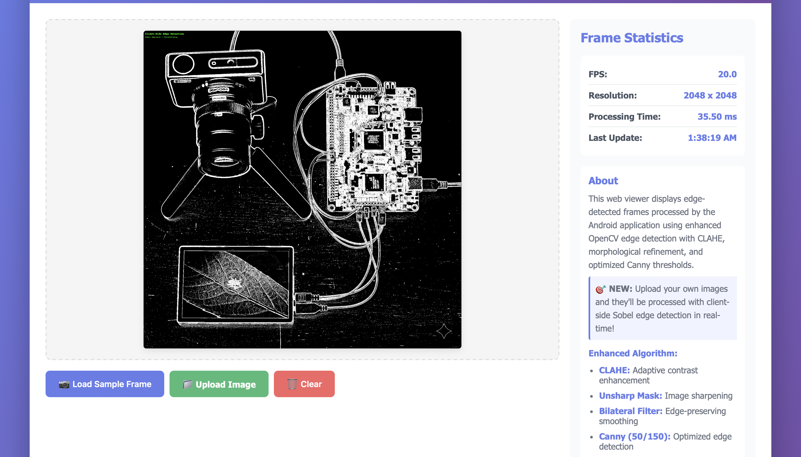

# Edge Detection  
**Android · OpenCV · OpenGL ES · TypeScript**

---

## Overview

**Edge Detection** is a cross-platform computer vision project that performs **real-time edge detection** using mobile and web technologies.  
The Android client captures live camera frames, processes them through **OpenCV (C++) via JNI**, and renders results with **OpenGL ES 2.0** for hardware acceleration.  
A companion **TypeScript web viewer** allows for browser-based testing and visualization of edge detection algorithms.

This project demonstrates an integrated pipeline combining **native image processing**, **GPU rendering**, and **cross-platform visualization**—ideal for research, benchmarking, or educational use.

---

## 📱 Demo


*Real-time edge detection using Canny algorithm*

## [Open-Source] Commented Code for easy understanding and feature updates.


## Features

### Android (Kotlin + C++)
- **Real-Time Camera Feed** — Implemented via the CameraX API.  
- **Native Processing** — Frame processing in C++ through JNI with OpenCV 4.8+.  
- **Canny Edge Detection** — High-performance, noise-reduced edge computation.  
- **OpenGL ES Rendering** — GPU-accelerated texture rendering at up to 60 FPS.  
- **Performance Metrics** — Real-time FPS and latency tracking.  
- **Dynamic Mode Switching** — Toggle between raw feed and processed output.  
- **Clean Architecture** — Clear separation of UI, native logic, and rendering.

### Web Viewer (TypeScript)
- **Canvas-Based Visualization** using the HTML5 API.  
- **Client-Side Edge Detection** implemented with the Sobel operator.  
- **Performance Overlay** — FPS, resolution, and processing time.  
- **Image Upload & Test Frame Generator** for quick experimentation.  
- **Responsive Interface** compatible with desktop and mobile devices.

---


## Project Structure

```
edge-detection/
├── app/                                    # Android application
│   ├── src/
│   │   └── main/
│   │       ├── java/com/flam/edgedetection/
│   │       │   ├── MainActivity.kt         # Main activity with camera setup
│   │       │   ├── NativeLib.kt           # JNI interface
│   │       │   └── gl/
│   │       │       └── GLRenderer.kt      # OpenGL ES renderer
│   │       ├── cpp/                       # Native C++ code
│   │       │   ├── CMakeLists.txt         # CMake build configuration
│   │       │   ├── native-lib.cpp         # JNI implementation
│   │       │   ├── edge_processor.h       # Edge processor header
│   │       │   └── edge_processor.cpp     # OpenCV processing logic
│   │       ├── res/                       # Android resources
│   │       └── AndroidManifest.xml
│   └── build.gradle
├── web/                                   # TypeScript web viewer
│   ├── src/
│   │   └── index.ts                       # Main viewer logic
│   ├── index.html                         # Web page
│   ├── styles.css                         # Styling
│   ├── package.json
│   └── tsconfig.json
├── settings.gradle
├── build.gradle
└── README.md
```

## System Architecture

```text
Camera Feed (YUV420)
       │
       ▼
YUV → RGB Conversion (JNI)
       │
       ▼
C++ Processing (OpenCV)
  ├─ Gaussian Blur
  └─ Canny Edge Detection
       │
       ▼
RGB Output → OpenGL Texture
       │
       ▼
Hardware Rendering (OpenGL ES 2.0)
```

### Components

1. **MainActivity (Kotlin)**
   - Manages camera lifecycle
   - Handles permissions
   - Orchestrates frame flow
   - Updates UI (FPS, mode)

2. **Native Layer (C++)**
   - `edge_processor.cpp`: Core OpenCV operations
   - `native-lib.cpp`: JNI bridge between Java and C++
   - Gaussian blur → Canny edge detection → RGB conversion

3. **OpenGL Renderer (Kotlin)**
   - Creates OpenGL ES 2.0 context
   - Manages textures and shaders
   - Renders frames at 60 FPS

4. **Web Viewer (TypeScript)**
   - Displays exported frames
   - Shows performance statistics
   - Modular, type-safe code


## Quick Start Guide

### Running the Web Viewer
```bash
cd web
npm install
npm run build
npm run serve
```
**Test edge detection:**
   - Click "📁 Upload Image" and select any photo
   - Watch it automatically process with Sobel edge detection!
   - Check the stats panel for processing time
   - 

### Running the Android App

#### Requirements

- Android Studio Hedgehog (2023.1.1) or later
- Android SDK 24+ (Android 7.0+)
- NDK (23.1.7779620 or later)
- CMake (3.22.1+)
- OpenCV Android SDK 4.8.0+
- Physical Android device or emulator with camera

### OpenCV Setup

1. Download OpenCV Android SDK from [OpenCV Releases](https://opencv.org/releases/)
2. Extract the SDK
3. Create `opencv` module in your project:
   - Copy `sdk/native` folder to `app/src/main/cpp/opencv/sdk/native/`
   - Or create a separate OpenCV module and import it

**Alternative**: Add OpenCV as a Gradle dependency:
```gradle
dependencies {
    implementation 'org.opencv:opencv:4.8.0'
}
```

#### Steps to Build and Run

1. **Clone the repository:**
```bash
git clone https://github.com/syedwam7q/edge-detection-android
cd edge-detection
```

2. **Open project in Android Studio:**
   - File → Open → Select the `edge-detection` directory

3. **Sync Gradle:**
   - Android Studio will prompt to sync - click "Sync Now"

4. **Connect Android device:**
   - Enable USB Debugging on your device
   - Connect via USB

5. **Build and install:**
```bash
./gradlew assembleDebug
./gradlew installDebug
```

Or simply click the **▶️ Run** button in Android Studio.

6. **Grant camera permissions** when prompted

7. **Toggle modes:**
   - Tap "TOGGLE MODE" to switch between raw feed and edge detection

## 📷 Screenshots

| Raw Camera Feed | Edge Detection | Web Viewer |
|----------------|----------------|----------------|
|  |  |  |

*Additional screenshots available: [raw-feed1.png](screenshots/raw-feed1.png), [edge-detection1.png](screenshots/edge-detection1.png)*

## Performance

- **FPS**: 15-30 FPS (depending on device)
- **Processing Time**: 20-40ms per frame (1080p)
- **Memory**: ~50MB (including OpenCV)
- **Supported Resolutions**: 480p to 4K

## 🔧 Configuration

### Canny Edge Detection Parameters

In `edge_processor.cpp`:
```cpp
double lowThreshold = 50.0;   // Lower threshold for edge detection
double highThreshold = 150.0; // Upper threshold for edge detection
```

### Camera Resolution

In `MainActivity.kt`:
```kotlin
val imageAnalysis = ImageAnalysis.Builder()
    .setTargetResolution(Size(1920, 1080))
    .build()
```


## References

- [OpenCV Documentation](https://docs.opencv.org/)
- [Android NDK Guide](https://developer.android.com/ndk/guides)
- [OpenGL ES 2.0 Specification](https://www.khronos.org/opengles/)
- [CameraX Documentation](https://developer.android.com/training/camerax)
  

## 👤 Author

Syed Wamiq
[github.com/syedwam7q]

## 📄 License

MIT License - Feel free to use for learning purposes.

---

**© 2025 Syed Wamiq · Built with Android Studio, C++, OpenCV, OpenGL ES and TypeScript.**
